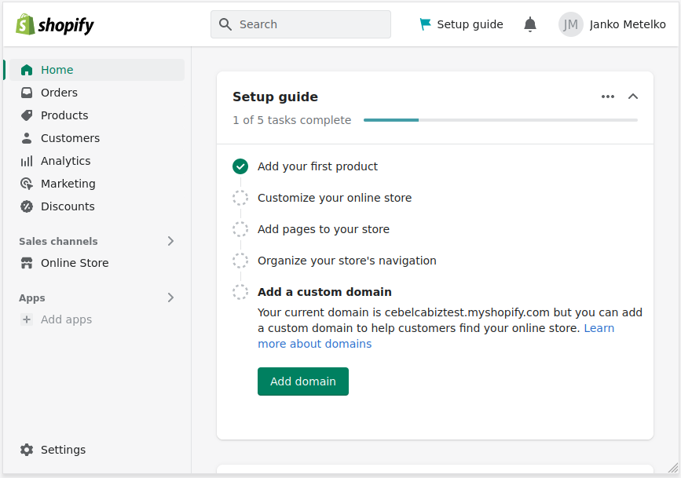

# Povezava s Shopify

## Kaj je Shopify?

Shopify je ponudnik spletnih trgovin. Z registracijo pri njih in mesečno naročnino lahko preko njih ustvarite svojo spletno trgovino.

## Kako deluje povezava?

Shopify se lahko poveže s Čebelco BIZ preko t.i. "Webhook"-a. Ko je naročilo izpolnjeno "fullfilled", Shopify pokliče Čebelco in javi podatke naročila. Na podlagi teh podatkov Čebelca BIZ kreira osnutek računa, katerega potem v Čebelci le izdate.

## Postopek vzpostavljanja povezave

### Najdite stran Notifications

Obiščite svoj Shopify dostop. Levo spodaj boste našli "**Settings**". Na naslednji strani kliknite na "**Notifications**". 

### Najdite Webhook-e

Pojdite na dno strani, kjer najdete "**Webhooks**". Vaša naloga je, da dodate webhook, ki bo ob zaključku naročila poklical Čebelco in Čebelca bo ustvarila osnutek računa.

### Dodajte integracijo na Čebelci

V drugem zavihku se prijavite v Čebelco ter pojdite na stran **Nastavitve**. Tam kliknite **Integracije**. V tabeli boste dodali integracijo, zato izberite **Shopify** kot vrsta integracije. Dajte ji neko ime, skrivni ključ zaenkrat pustite prazen ter kliknite **Dodaj**.

### Pridobite podatke za integracijo

Ko ste integracijo dodali, pri njej kliknite **Podatki za integracijo**. Odpre se vam okence s potrebnimi nastavitvami za Shopify "webhook".

### Ustvarite Webhook

Preklopite na zavihek s Shopify. Kliknite "**Create webhook**" in izpolnite obrazec s podatki, ki vam jih predlaga Čebelca okence. Potem kliknite "**Save**".

### Dodajte skrivno kodo

V tabeli boste videli "Webhook", ki ste ga ustvarili. Spodaj pa kodo na mareličnem ozadju (na sliki 915...). Svojo kodo si označite in kopirajte. Preklopite na zavihek s Čebelco in kliknite 'Uredi' pri obstoječi integraciji. V okence **Skrivna koda** prilepite kodo in shranite.

### Stestirajte povezavo

Tako, povezava med vašim Shopify in Čebelco je vzpostavljena. V zavihku shopify, lahko kliknete na desni "**Send test notification**" in v vaši Čebelci se bo ustvaril nov osnutek računa. Preverite ga in ga pobrišete.

