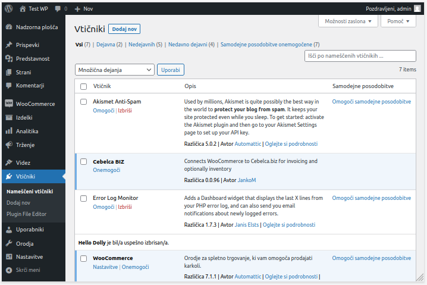
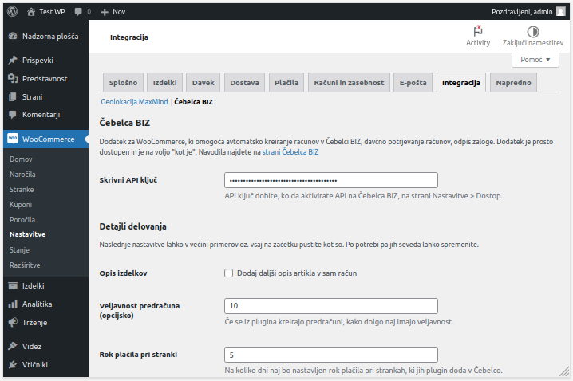
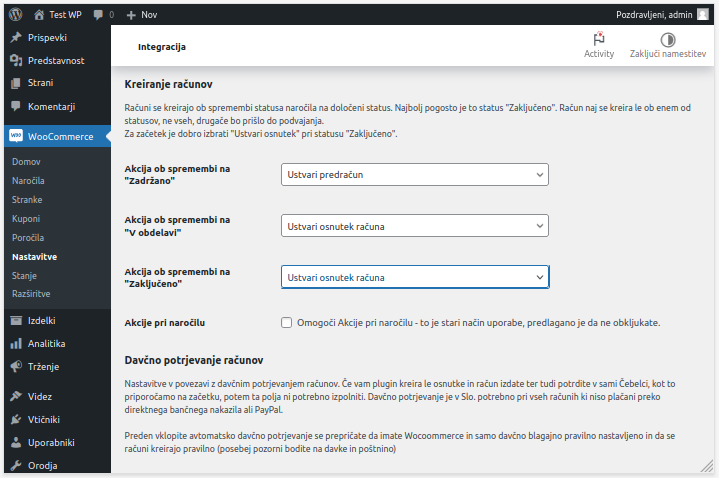
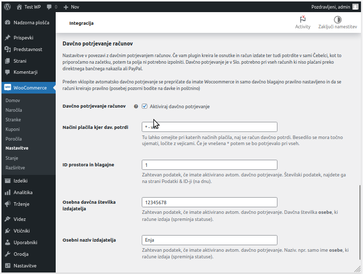

# Dodatek za WooCommerce

## Kaj je Čebelca BIZ dodatek za Woocommerce?

Čebelca BIZ WooCommerce dodatek je WordPress "vtičnik" za e-trgovino, ki omogoča avtomatsko dodajanje kupcev, ustvarjanje računov, dodajanje plačil in kreiranje dobavnic glede na status naročil v spletni trgovini.

Dodatek je na voljo brezplačno na spletni strani Cebelca BIZ WooCommerce na Github-u in je odprtokodni projekt, uporabniki pa so vabljeni, da svoje izboljšave in popravke objavijo na Github-u.

## Kje dobite dodatek?

Dodatek najdete na Github strani: [CebelcaBIZ-WooCommerce](https://github.com/InvoiceFox/CebelcaBIZ-WooCommerce)

Zip paket dodatka, ki ga lahko neposredno namestite na vaš woocommerce, pridobite s klikom na tipko **Code** in potem **Download ZIP**.

***Dodatek je prosto dostopen in je na voljo "kot je". Za namestitev in 
morebitno prilagoditev v vašo spletno trgovino morate poskrbeti
sami. V večini primerov pa deluje brez posebnega prilagajanja.***

## Namestitev

V vašem Wordpres upravljanju obiščete stran **Vtičniki** > **Dodaj nov**. Ter levo zgoraj kliknete **Naloži vtičnik**. Iz svojega računalnika izberete zgoraj preneseno ZIP datoteko in **naloži**.

Potem ga poiščete na **Vtičniki** > **Nameščeni vtičniki** in pri dodatku **Čebelca BIZ** kliknete v **omogoči**. Dodatek je tako nameščen.

## Nastavitve dodatka

V menuju na levi pojdite na **WooCommerce** > **Nastavitve** > **Integracija** > **Čebelca BIZ**. 

Prva stvar, ki jo vnesete je **API Ključ**. API ključ dobite na strani Čebelca > Nastavitve > Dostop. Na dnu strani aktivirate API dostop in pokaže se vam API ključ.

Naslednjo rubriko nastavitev **Detajli delovanja** lahko zaenkrat spustite.

Pojdite nižje do rubrike **Kreiranje računov**. Računi se ustvarijo avtomatsko, ko naročilo dobi določen status. To, ob katerem statusu se račun ustvari in kaj točno se zgodi, nastavljate na tem delu.

Na voljo imate 3 statuse:

* Zadržano
* V obdelavi
* Zaključeno

Ustvari se lahko samo osnutek, račun se lahko tudi izda (dobi številko), računu se lahko označi način plačila, ustvari se lahko dobavnica v skladišču in pri statusu zaključeno, se lahko kupcu pošlje PDF izdanega računa na e-pošto. Pošlje jo vaš WooCommerce sam, PDF pa se potem, ko je račun ustvaril in izdal, prenese iz Čebelce BIZ.

**Za začetek** je dobra nastavitev, da pri spremembi na status **Zaključeno** izberete, naj se ustvari osnutek računa. Osnutek lahko potem v Čebelci izdate, davčno potrdite ali pa pobrišete, če npr. še testirate.

Kasneje lahko nastavite, da se več ali vsi koraki zgodijo avtomatsko, a takrat bodite prepričani, da imate dobro nastavljeno trgovino ter dodatek. Preverite, da je davek v spletni trgovini pravilno nastavljen, da so stroški dostave pravilno nastavljeni in da se račun pravilno prenese. Še posebej je to pomembno, če nastavite avtomatsko **davčno potrjevanje računov** (davčno blagajno) v Čebelci.

## Kako delujejo statusi?

Načeloma se da to nastavljati, a v osnovi je tako, da če je način plačila **Po povzetju**, naročilo samo pridobi status **V obdelavi**. 

Če je način plačila **bančno nakazilo**, kar se včasih smatra kot *plačilo po predračunu*, pa naročilo samo pridobi status **Zadržano**. Dodatek omogoča, da lahko v tem primeru npr. Čebelca sama naredi predračun. 

Večina uporabnikov si dodatek nastavi tako, da se račun ustvari, kasneje pa tudi izda in pošlje na e-pošto, ob statusu **Zaključeno**.

## Davčna blagajna

Vse račune, **ki niso plačani z direktnim nakazilom na vaš bančni račun ali s PayPal**, je potrebno davčno potrditi. To vam omogoča Čebelca. Če WooCoomerce dodatek kreira le osnutke, lahko potem račun pregledate, v čebelci izdate in, če imate stvari tako nastavljeno, tudi davčno potrdite v sami Čebelci.

Lahko pa nastavite tudi avtomatsko davčno potrjevanje računov iz samega dodatka. V tem primeru morate izpolniti rubriko **Davčna blagajna**.

## Uporaba s skladiščem

Če v Čebelci BIZ vodite tudi zalogo z modulom Skladišče, boste želeli, da račun, ki se kreira preko WooCommerce, lahko tudi odpiše
zalogo. V tem primeru bodite pozorni na naslednje stvari.

* Izdelki v WooCommerce morajo imeti vnešen SKU
* SKU mora biti enak, kot je šifra artikla v Čebelca Skladišču

To je potrebno zato, da Čebelca najde pravi artikel in ga odpiše.

Skladiščni dokument (dobavnico) lahko ustvarite sami ročno s klikom na računu v Čebelca BIZ, potem pa uporabite tipko **V sklad. dok.**. Takšen dokument potem zmanjša zalogo v izbranem skladišču. 
Lahko pa tudi nastavite plugin tako, da se to zgodi avtomatsko ob spremembi statusa npr. na **Zaključeno**.
