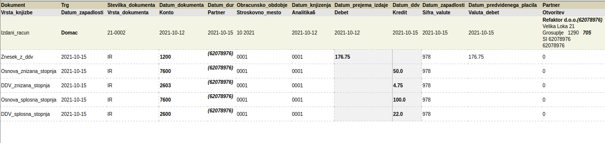
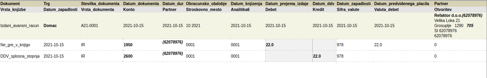
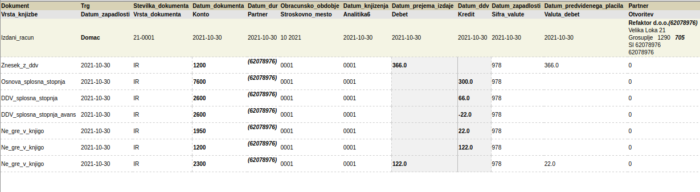
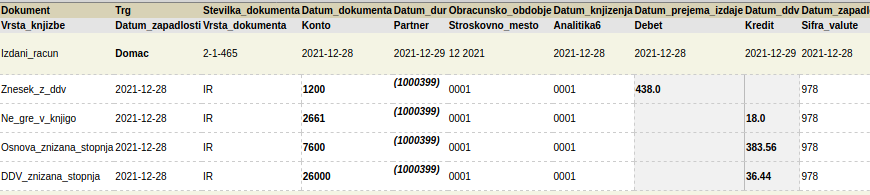

# Izvoz podatkov za računovodstvo

## Uvod

Spletni program omogoča izvoz podatkov v XML obliki v najbolj razširjene računovodske programe v Sloveniji. Zapis VOD XML podpirajo programi Vasco, Opal 
in Datalab Pantheon, SAOP MiniMax pa ima svoj XML zapis. XML zapisi običajno omogočajo neposreden uvoz knjižb v glavno knjigo. Zato morate v Čebelca BIZ
nastaviti željene konte.

## Kazalo

* [Nastavitve in vnos podatkov](#nastavitve-in-vnos-podatkov)
  * [Kontni načrt](#kontni-načrt)
  * [Konti za ne-računovodje](#konti-za-ne-računovodje)
  * [Šifre partnerjev](#šifre-partnerjev)
  * [Trg: domači, EU, tuji](#trg-domači-eu-tuji)
* [VOD in SAOP XML](#vod-in-saop-xml)
  * [Postopek izvoza](#postopek-izvoza)
  * [Primeri knjižb](#primeri-knjižb)
  * [Avansni in končni račun](#avansni-in-končni-račun)
  * [Turistične takse](#turistične-takse)
* [Ostale možnosti izvoza](#ostale-možnosti-izvoza)
  * [Oblikovano poročilo prodaje (Excel)](#oblikovano-poročilo-prodaje-excel)
  * [Oblikovan seznam računov (Excel)](#oblikovan-seznam-računov-excel)
  * [E-slog (e-račun) XML](#e-slog-e-račun-xml)

## Nastavitve in vnos podatkov

### Kontni načrt

Pri uvozu v računovodske programe Vasco, Opal, Datalab in MiniMax podatki uvozijo neposredno v v Glavno knjigo. Knjižbe v glavni knjigi morajo vsebovati 
pravilne **računovodske konte**, zato se posvetujte z vašim računovoskim servisom kakšne konte želijo. Kontni načrt se nastavi v Čebelci na strani 
**Nastavitve > Kontni načrt**.

Lahko za začetek te nastavitve tudi pustite kot so, saj so nastavljene na najbolj pogoste vrednosti, računovodja pa vam po povedal če je potrebno kaj prilagoditi.

### Konti za ne-računovodje

S konti se bo ukvarjalo vaše računovodstvo. Le za res najbolj osnovno predstavo, konti so nekakšne kategorije, označujejo jih določene številke.
Odvisno od račuvodstva so lahko to 3, 4 ali več-mestna števila. Pri izdanih računih gre najbolj pogosto za 3 kontne skupine 1xxx/12xx, 26xx, 76xx:

* 10xx - denarna sredstva v blagajni 
* 12xx - terjatve do kupcev 
* 26xx - obveznosti do države (davki, npr ddv)
* 76xx - poslovni prihodki

Točen konto je lahko odvisen od načina plačila, države kupca, davčne stopnje, itd.

### Šifre partnerjev

Če je partner (kupec) podjetje je šifra njihova davčna številka. Ta sistem je podprt v vseh zgoraj naštetih računvoodskih programih in tako se izognete 
dodatnemu koraku - sinhronizaciji partnerjev. Vse kupce fizične osebe pa računovodstva običajno knjižijo pod isto (določeno) šifro. To šifro si lahko nastavite
na strani **Kontni načrt** spodaj. Če partner ne bo imel vnešene davčne številke in ste v tej nastavitvi kaj vpisali, bo program določil to šifro partnerja.

### Trg, domači, EU, tuji

Da bo program vedel v kateri trg naj dodeli določen račun morate pri partnerju pravilno vnesti ID za ddv in Državo. 
* Če je partner podjetje v EU, potem vnesite njihod ID za DDV skupaj s predpono. Npr. v Sloveniji je ta SI, v Italiji IT, itd. 
* Če kupec nima ID za DDV (je fizična oseba), potem pravilno vnesite državo. Če je ta v EU v polje država dodajte "**, EU**"
* Če je kupec iz Slovenije je lahko polje država prazno, ID za ddv ali davčno številko pa vneste glede na to ali do ali niso davčni zavezanci

## VOD in SAOP XML

### Postopek izvoza

Za izvoz obiščite stran **Podatki** zgoraj desno. XML izvoz najdete v prvi rubriki **Uvoz v računovdski program**. Za Vasco in Datalab izberite prvo opcijo VOD XML. Opal ima svojo opcijo VOD XML. SAOP pa še nižje svoj XML zapis. Vnesite obdobje preko "Od" in "Do" datumov, ter pritisnite **Prenesi**. S kljukico lahko določite ali naj se za izbiro obdobja upošteva datum izdaje računa ali datum opravljene storitve. 

VOD XML opcije omogočajo tudi **vizualen predogled** izvoženih podatkov v tabelarični obliki. Izberite opcijo **oblikovani VOD XML**. Če ste v Firefox ali Chrome 
brskalniku se vam bo prikazala tabela v obliki glavne knjige z podakti, kot se bodo izvozili. Tu lahko preverite konte, šifre, trg in zneske oz. to pokažete računvodstvu.

### Primeri knjižb

Običajen račun z dvema stopnjama DDV se bo izvozil takole (slika prikazuje oblikovani VOD XML):

### Avansni in končni račun

Avansni račun se ne šteje pod prihodke, ti se upoštevajo šele ob izdaji končnega računa. Več o samih avansnih računih na [tej strani](racuni/avansni_racuni.md).

Primer knjižb avansnega računa za 100 EUR:

Primer knjižb končnega računa za 300 EUR, delno poravnanega z avansom v vrednosti 100 EUR.

### Turistične takse

Turistične in druge takse se izvozijo pod svoj konto. Pri vnosu naj uporabnik v polju za DDV izbere 0% Ostali davki. Tako se bo taksa pravilno poročala 
v sistemu davčnih blagajn, in tudi pri izvozu jo ne bo dodalo k prihodkom ampak pod svoj konto. Na primer 2661. Program uporašteva pod takse tudi postavke, ki imajo davek 0% in v besedilo besedo "taksa".

## Ostale možnosti izvoza

### Oblikovano poročilo prodaje (Excel)

Če želite dnevno poročilo, mesečno poročilo ali poročilo za poljubno obdobje uporabite ta izvoz. Podatki se izvozijo sešteti za obdobje, a ločeni po davčnih stopnjah in načinih plačila. 

### Oblikovan seznam računov (Excel)

Ustvari se seznam vseh računov za izbrano obdobje, zneske prikaže za vsak račun posebej glede na davčno stopnjo in način plačila.

### E-slog (e-račun) XML

E-slog 2.0 je standard za slovenske elektronske račune. Uporablja se predvsem pri poslovanju s proračunskimi uporabniki, nekateri računovodski programi pa omogočajo uvoz računov preko tega zapisa.
